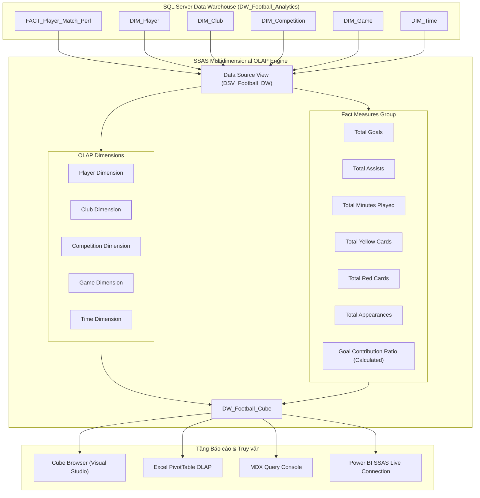

# CHƯƠNG 3: THỰC HIỆN PHÂN TÍCH TRÊN KHO DỮ LIỆU (SSAS)

---

## 3.1. Tổng quan về SQL Server Analysis Services (SSAS) trong Dự án
Hệ thống **SSAS (SQL Server Analysis Services)** đóng vai trò là tầng phân tích đa chiều (OLAP Engine) trung gian giữa Kho dữ liệu SQL Server (`DW_Football_Analytics`) và các công cụ lập báo cáo (Power BI, Excel PivotTable, MDX Console).

Dự án triển khai mô hình **SSAS Multidimensional Cube** (hoặc **SSAS Tabular Model**) với mục tiêu:
- Tối ưu hóa tốc độ truy vấn tổng hợp trên tập dữ liệu hơn **1.890.000 lượt ra sân thi đấu**.
- Cung cấp các **Độ đo (Measures)** và **Độ đo tính toán (Calculated Measures)** phục vụ phân tích phong độ cầu thủ, hiệu quả vận hành câu lạc bộ và diễn biến giải đấu.
- Thiết lập các **Phân cấp dữ liệu (Hierarchies)** và **Quan hệ chiều (Dimension Relationships)** chuẩn mô hình Hình sao (Star Schema).

---

## 3.2. Cấu trúc Tài liệu & Thư mục Hướng dẫn SSAS (`ssas/`)

Toàn bộ tài liệu hướng dẫn kỹ thuật chi tiết từng bước cho Chương 3 được lưu trữ trong thư mục [`ssas/`](ssas/):

| STT | Tên tài liệu | Nội dung hướng dẫn chính | Tệp chi tiết |
| :---: | :--- | :--- | :--- |
| **3.1 - 3.2** | **Tổng quan Project & Kết nối Data Source** | Hướng dẫn tạo SSAS Multidimensional Project trong Visual Studio (SSDT), thiết lập kết nối Data Source tới SQL Server Database `DW_Football_Analytics`. | 📄 [ssas_overview.md](ssas/ssas_overview.md) |
| **3.3 - 3.4** | **Data Source View (DSV) & Thiết lập Dimensions** | Hướng dẫn đưa bảng `FACT_Player_Match_Perf` và 5 bảng `DIM` vào DSV; cấu hình 5 Dimensions (`DIM_Player`, `DIM_Club`, `DIM_Competition`, `DIM_Game`, `DIM_Time`). | 📄 [ssas_dsv_dims.md](ssas/ssas_dsv_dims.md) |
| **3.5** | **Thiết lập Cube & Định nghĩa Measures** | Hướng dẫn khởi tạo `DW_Football_Cube`, cấu hình các Measure cơ bản (Sum Goals, Sum Assists, Sum Minutes Played...) và Calculated Measures (Goal Contributions, Avg Minutes/Match, Starter Ratio...). | 📄 [ssas_cube_measures.md](ssas/ssas_cube_measures.md) |
| **3.6 - 3.7** | **Quan hệ Chiều & Phân cấp Dữ liệu** | Hướng dẫn thiết lập Quan hệ Chiều (Dimension Relationships) giữa Fact và 5 Dim, xây dựng Phân cấp Dữ liệu (Attribute & User-Defined Hierarchies: Time, Club, Competition, Player). | 📄 [ssas_hierarchies_relations.md](ssas/ssas_hierarchies_relations.md) |
| **3.8 - 3.10**| **Deploy SSAS & 15 Câu Truy vấn OLAP / MDX** | Hướng dẫn Deploy & Process SSAS Cube; thực thi và kiểm tra 15 câu truy vấn nghiệp vụ bóng đá bằng Cube Browser, Excel PivotTable và ngôn ngữ MDX. | 📄 [ssas_deploy_mdx.md](ssas/ssas_deploy_mdx.md) |

---

## 3.3. Sơ đồ Kiến trúc OLAP Cube (`DW_Football_Cube`)

---

## 3.4. Danh mục 15 Bài toán Phân tích OLAP Đa chiều

Tương ứng với 15 câu truy vấn nghiệp vụ trong Kho dữ liệu, SSAS Cube hỗ trợ phân tích đa chiều qua 3 công cụ chính:

1. **Top 10 Chân sút Hàng đầu Mùa giải (Top Goal Scorers by Season)**: Slice & Dice theo `DIM_Time` [Season] và `DIM_Player` [Player_Name].
2. **Hiệu suất Bàn thắng & Kiến tạo theo Vị trí Thi đấu**: Drill-down từ `Main_Position` xuống `Sub_Position`.
3. **Phân tích Tổng Số Phút Thi đấu & Cờ Đá chính (Starter)**: Tổng hợp `Minutes_Played` và đếm lượt ra sân đá chính (`Is_Starter = 1`).
4. **Thống kê Kỷ luật Thẻ phạt theo Câu lạc bộ**: Roll-up `Yellow_Cards` và `Red_Cards` theo `DIM_Club` [Club_Name].
5. **So sánh Phong độ Sân nhà vs Sân khách của CLB**: Slice theo `Is_Home_Game` (1/0) và `Player_Club_ID`.
6. **Thống kê Khán giả Trung bình & Kết quả theo Sân vận động**: Phân tích `Stadium_Name` và `Stadium_Seats` liên kết với `DIM_Game`.
7. **Phân tích Hiệu suất Cầu thủ theo Nhóm Tuổi & Quốc tịch**: Phân cấp `Country_Of_Citizenship` -> `Age Group` -> `Player_Name`.
8. **Hiệu suất Đóng góp Bàn thắng theo Cấp độ Giải đấu**: Phân loại `Competition_Type` (VĐQG vs Cúp Châu Âu - `CL`, `EL`, `GB1`, `ES1`...).
9. **Tỷ lệ Chuyển đổi Cơ hội & Số trận Giữ sạch lưới theo HLV**: Phân tích theo `Coach_Name` và `DIM_Club`.
10. **Phân tích Xu hướng Thi đấu theo Quý và Tháng**: Phân cấp Thời gian (`Year` -> `Quarter` -> `Month` -> `FullDate`).
11. **Top 5 Cầu thủ dính Thẻ đỏ nhiều nhất theo Giải đấu**: Phân tích kỉ luật thẻ phạt trên từng giải quốc nội.
12. **Ma trận Tương quan giữa Chiều cao và Vị trí Thi đấu**: Phân nhóm `Height_In_Cm` theo `Main_Position`.
13. **Phân tích Tải trọng Thi đấu (Minutes Played) của Cầu thủ Trẻ (< 21 tuổi)**: Slice theo `Age < 21` và `Season`.
14. **So sánh Đóng góp Bàn thắng giữa Cầu thủ Chân thuận (Left vs Right Foot)**: Slice theo `Foot` và `Main_Position`.
15. **Thống kê Tổng hợp Toàn diện Hiệu suất CLB theo Mùa giải**: Tổng hợp đồng thời Goals, Assists, Yellow Cards, Red Cards, Total Appearances.

---

👉 **Nhấn vào các liên kết trong thư mục [`ssas/`](ssas/) ở trên để xem chi tiết từng bước thực hành cấu hình SSAS.**
