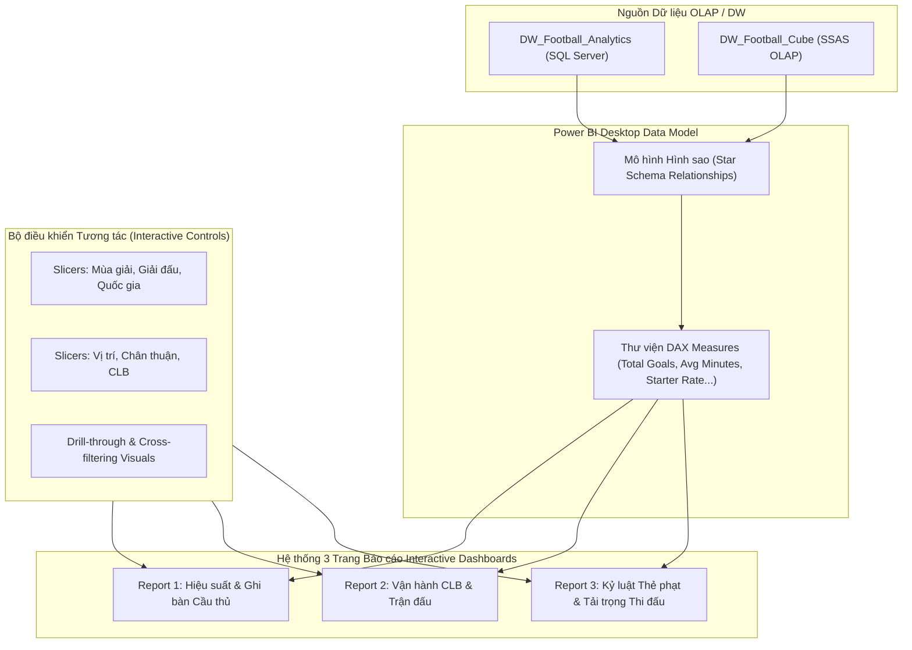

# CHƯƠNG 4: QUÁ TRÌNH LẬP BÁO BIỂU (POWER BI & REPORTING)

---

## 4.1. Tổng quan về Quá trình Lập Báo biểu trong Dự án
Tầng báo cáo hiển thị trực quan (Visual Reporting Layer) được thiết lập bằng **Power BI Desktop** kết nối trực tiếp với **Kho dữ liệu SQL Server** (`DW_Football_Analytics`) hoặc **SSAS OLAP Cube** (`DW_Football_Cube`).

Hệ thống báo cáo được thiết kế gồm **3 Báo cáo Trực quan tương tác chính (3 Interactive Dashboards/Reports)**, giúp ban huấn luyện, chuyên viên phân tích thể thao và quản lý CLB theo dõi toàn diện bức tranh bóng đá Châu Âu:

1. **Report 1: Phân tích Hiệu suất & Ghi bàn Cầu thủ (Player Performance & Goal Scoring Analytics)**
2. **Report 2: Phân tích Trận đấu & Vận hành Câu lạc bộ (Match Context & Club Operational Analytics)**
3. **Report 3: Phân tích Kỷ luật Thẻ phạt & Tải trọng Thi đấu (Discipline & Playing Time Analytics)**

---

## 4.2. Cấu trúc Tài liệu & Thư mục Hướng dẫn Power BI (`powerbi/`)

Toàn bộ tài liệu hướng dẫn kỹ thuật chi tiết từng bước xây dựng các trang báo cáo được lưu trữ trong thư mục [`powerbi/`](powerbi/):

| STT | Tên tài liệu | Nội dung hướng dẫn chính | Tệp chi tiết |
| :---: | :--- | :--- | :--- |
| **4.1** | **Overview & DAX Data Modeling** | Khởi tạo Project Power BI Desktop, Kết nối SQL Server / SSAS, Thiết lập Star Schema Model & Viết 10 DAX Measures cốt lõi. | 📄 [powerbi_overview.md](powerbi/powerbi_overview.md) |
| **4.2** | **Report 1: Player Performance Analysis** | Hướng dẫn từng bước kéo thả biểu đồ, thiết lập slicers, format visual cho Report 1 (Top Scorers, Position Matrix, Goal Trend). | 📄 [powerbi_report1_player_perf.md](powerbi/powerbi_report1_player_perf.md) |
| **4.3** | **Report 2: Club & Match Analytics** | Hướng dẫn xây dựng Report 2 (Home vs Away Wins, Stadium Attendance, Club Points & Goals Treemap). | 📄 [powerbi_report2_club_match.md](powerbi/powerbi_report2_club_match.md) |
| **4.4** | **Report 3: Discipline & Playing Time** | Hướng dẫn xây dựng Report 3 (Yellow/Red Card Breakdown by Position/Club, Minutes Played by Age, Starter Ratio). | 📄 [powerbi_report3_discipline_load.md](powerbi/powerbi_report3_discipline_load.md) |

---

## 4.3. Sơ đồ Cấu trúc Dashboard Power BI

---

## 4.4. Tóm tắt Danh mục Biểu đồ & DAX Measures Cốt lõi

### Các DAX Measures Chính:
- **`Total Goals`** = `SUM(FACT_Player_Match_Perf[Goals])`
- **`Total Assists`** = `SUM(FACT_Player_Match_Perf[Assists])`
- **`Total Minutes Played`** = `SUM(FACT_Player_Match_Perf[Minutes_Played])`
- **`Goal Contributions`** = `[Total Goals] + [Total Assists]`
- **`Avg Minutes Per Match`** = `DIVIDE([Total Minutes Played], COUNTROWS(FACT_Player_Match_Perf), 0)`
- **`Starter Rate %`** = `DIVIDE(CALCULATE(COUNTROWS(FACT_Player_Match_Perf), FACT_Player_Match_Perf[Is_Starter] = 1), COUNTROWS(FACT_Player_Match_Perf), 0)`
- **`Yellow Card Rate`** = `DIVIDE(SUM(FACT_Player_Match_Perf[Yellow_Cards]), COUNTROWS(FACT_Player_Match_Perf), 0)`

---

👉 **Nhấn vào các liên kết trong thư mục [`powerbi/`](powerbi/) ở trên để xem chi tiết từng bước thực hành tạo Báo cáo Power BI.**
