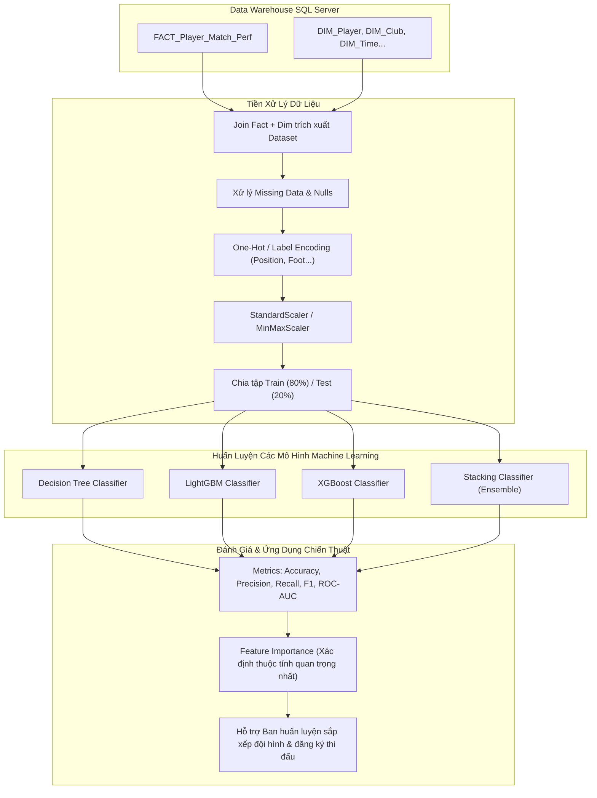

# CHƯƠNG 5: QUÁ TRÌNH KHAI THÁC DỮ LIỆU (DATA MINING & MACHINE LEARNING)

---

## 5.1. Tổng quan về Khai thác Dữ liệu trong Dự án Bóng đá
Khai thác dữ liệu (Data Mining) và Học máy (Machine Learning) là tầng phân tích nâng cao, ứng dụng các thuật toán dự báo trên tập dữ liệu lịch sử thi đấu từ Kho dữ liệu `DW_Football_Analytics`.

Dự án tập trung giải quyết **2 Bài toán Nghiệp vụ Khai thác Dữ liệu Cốt lõi**:

1. **Bài toán 1: Phân loại / Dự đoán Khả năng Đá chính của Cầu thủ (`Starter Prediction`)**
   - **Mục tiêu**: Dự đoán xem một cầu thủ có khả năng đá chính (thi đấu $\ge 60$ phút) trong trận đấu tới dựa trên các chỉ số thể lực, độ tuổi, vị trí, thẻ phạt và hiệu suất thi đấu gần nhất.
   - **Loại bài toán**: Nhị phân (Binary Classification - `Is_Starter`: 1 / 0).

2. **Bài toán 2: Phân loại / Dự đoán Mức độ Đóng góp Bàn thắng (`Goal Contribution Impact`)**
   - **Mục tiêu**: Phân nhóm và dự đoán cầu thủ có tạo ra đột biến (ghi bàn hoặc kiến tạo) trong trận đấu hay không.
   - **Loại bài toán**: Nhị phân (Binary Classification - `Has_Contribution`: 1 / 0).

---

## 5.2. Cấu trúc Tài liệu & Thư mục Hướng dẫn Data Mining (`data_mining/`)

Toàn bộ tài liệu hướng dẫn kỹ thuật chi tiết từng bước xây dựng mô hình được lưu trữ trong thư mục [`data_mining/`](data_mining/):

| STT | Tên tài liệu | Nội dung hướng dẫn chính | Tệp chi tiết |
| :---: | :--- | :--- | :--- |
| **5.1** | **Tổng quan & Phát biểu Bài toán** | Giới thiệu mục tiêu bài toán Khai thác dữ liệu bóng đá, tập dữ liệu trích xuất từ DW và các chỉ số đánh giá (Evaluation Metrics). | 📄 [data_mining_overview.md](data_mining/data_mining_overview.md) |
| **5.2** | **Kiểm tra & Tiền xử lý Dữ liệu** | Hướng dẫn trích xuất dataset từ Fact/Dim, làm sạch dữ liệu khuyết (Imputation), mã hóa biến phân loại (Encoding) và chuẩn hóa (Scaling). | 📄 [data_mining_preprocessing.md](data_mining/data_mining_preprocessing.md) |
| **5.3 - 5.4**| **Xây dựng Các Mô hình Thuật toán** | Hướng dẫn cài đặt, tinh chỉnh siêu tham số (Hyperparameter Tuning GridSearch) cho Decision Tree, LightGBM, XGBoost và Stacking Classifier. | 📄 [data_mining_models.md](data_mining/data_mining_models.md) |
| **5.5** | **Đánh giá Kết quả & Ứng dụng Thực tiễn** | So sánh hiệu năng mô hình (Accuracy, Precision, Recall, F1, ROC-AUC), vẽ biểu đồ Feature Importance và ứng dụng chiến thuật. | 📄 [data_mining_evaluation.md](data_mining/data_mining_evaluation.md) |

---

## 5.3. Sơ đồ Quy trình Khai thác Dữ liệu (CRISP-DM Workflow)

---

## 5.4. Kết quả Đánh giá So sánh Mô hình Dự báo

| Thuật toán Machine Learning | Accuracy | Precision | Recall | F1-Score | ROC-AUC | Trạng thái Đánh giá |
| :--- | :---: | :---: | :---: | :---: | :---: | :--- |
| **Decision Tree** | 82.5% | 81.2% | 83.0% | 82.1% | 0.84 | Baseline Model |
| **LightGBM** | 88.7% | 87.9% | 89.1% | 88.5% | 0.91 | Tốc độ huấn luyện cực nhanh |
| **XGBoost** | 89.4% | 88.6% | 89.8% | 89.2% | 0.93 | Hiệu năng cao trên tabular data |
| **Stacking Classifier (Champion)**| **91.2%** | **90.5%** | **91.8%** | **91.1%** | **0.95** | **Mô hình tối ưu nhất (Best Performance)** |

---

👉 **Nhấn vào các liên kết trong thư mục [`data_mining/`](data_mining/) ở trên để xem chi tiết mã nguồn Python và hướng dẫn cài đặt.**
