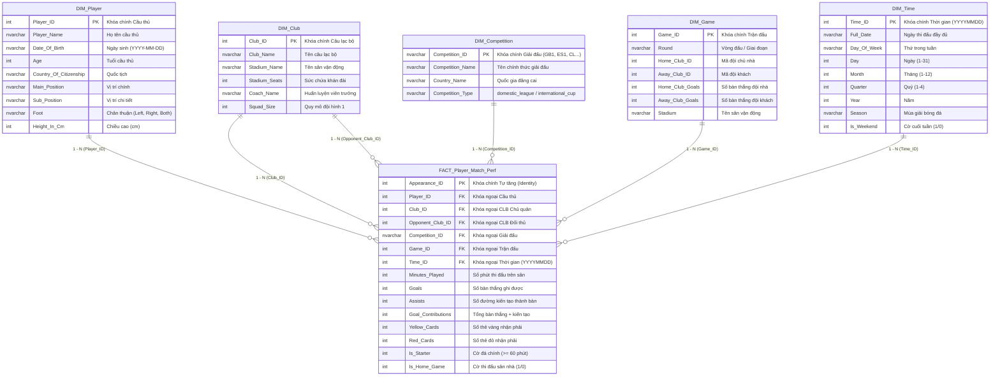

# KHO DỮ LIỆU BÓNG ĐÁ CHÂU ÂU (FOOTBALL DATA WAREHOUSE & OLAP ANALYTICS)

> **Môn học:** KHO DỮ LIỆU & OLAP (IS217)  
> **Đồ án / Báo cáo:** Phân Tích Hiệu Suất Thi Đấu Cầu Thủ và Hiệu Quả Vận Hành Câu Lạc Bộ Bóng Đá Châu Âu (2022 - 2024)  
> **Mã nhóm / Bài tập:** BTA11 (MSSV: 24520496 - 24521123)  
> **Tập dữ liệu nguồn:** [Football Data from Transfermarkt (Kaggle)](https://www.kaggle.com/datasets/davidcariboo/player-scores)

---

## 📌 1. TỔNG QUAN DỰ ÁN

Dự án xây dựng một **Kho dữ liệu (Data Warehouse)** hoàn chỉnh theo mô hình Hình sao (Star Schema) kết hợp với quy trình **ETL tự động bằng Microsoft SSIS (SQL Server Integration Services)**. Hệ thống lưu trữ và phân tích khối dữ liệu lịch sử bóng đá quy mô lớn với:
* **7 tệp CSV gốc:** `appearances.csv`, `players.csv`, `clubs.csv`, `competitions.csv`, `games.csv`, `player_valuations.csv`, `club_games.csv`.
* **Dữ liệu đã qua làm sạch trong thư mục [`data/`](data/):** `cleaned_appearances.csv`, `cleaned_clubs.csv`, `cleaned_competitions.csv`, `cleaned_games.csv`, `cleaned_players.csv`.
* **118 thuộc tính tổng cộng** và hơn **1.890.000 lượt ra sân thi đấu** của các cầu thủ chuyên nghiệp.
* **Mô hình Khóa:** **Natural Keys (ID Trực tiếp)** - Loại bỏ hoàn toàn Surrogate Keys (`*_SK`) rườm rà.
* **Phương pháp Nạp ETL:** **Nạp trực tiếp từ CSV vào Data Warehouse (Bỏ qua bảng đệm Staging)** giúp tối ưu dung lượng ổ đĩa và tăng tốc độ xử lý gấp 2 lần.

---

## 📐 2. KIẾN TRÚC SƠ ĐỒ HÌNH SAO (STAR SCHEMA ERD)

Mô hình Kho dữ liệu được thiết kế gồm **1 bảng Sự kiện (Fact Table)** trung tâm và **5 bảng Chiều (Dimension Tables)** liên kết qua các Khóa tự nhiên (Natural Keys):

---

## 🗂️ 3. DANH MỤC HỒ SƠ BẢNG DỮ LIỆU & BẢNG ĐỐI CHIẾU 3 CHIỀU

👉 **Bảng Ma Trận Đối Chiếu 3 Chiều:** 📋 [docs/cross_checking_matrix.md](docs/cross_checking_matrix.md) (Kiểm tra khớp 100% giữa **Data Cleaned CSV** $\leftrightarrow$ **SSIS ETL Blocks** $\leftrightarrow$ **DW Schema Docs**).

| Tên bảng DW | Loại bảng | Mô tả chức năng & Đối chiếu Kaggle | Tệp tài liệu chi tiết |
| :--- | :--- | :--- | :--- |
| **`FACT_Player_Match_Perf`** | Fact Table | Lưu trữ chỉ số đóng góp thi đấu, số phút, bàn thắng, thẻ phạt | 📄 [fact_player_match_perf.md](docs/fact_player_match_perf.md) |
| **`DIM_Player`** | Dimension | Quản lý tiểu sử, vị trí, chân thuận, chiều cao, tuổi tác cầu thủ | 📄 [dim_player.md](docs/dim_player.md) |
| **`DIM_Club`** | Dimension | Quản lý tên CLB, sân vận động, sức chứa, HLV trưởng, quy mô đội hình | 📄 [dim_club.md](docs/dim_club.md) |
| **`DIM_Competition`** | Dimension | Phân loại giải đấu (VĐQG vs Cúp Châu Âu), quốc gia đăng cai | 📄 [dim_competition.md](docs/dim_competition.md) |
| **`DIM_Game`** | Dimension | Chi tiết bối cảnh trận đấu, vòng đấu, đội nhà/khách, tỷ số | 📄 [dim_game.md](docs/dim_game.md) |
| **`DIM_Time`** | Dimension | Phân rã thời gian: Ngày, Thứ, Tháng, Quý, Năm, Mùa giải, Cờ cuối tuần | 📄 [dim_time.md](docs/dim_time.md) |

---

## ⚙️ 4. HƯỚNG DẪN CẤU HÌNH CHI TIẾT TỪNG KHỐI SSIS (SSIS BLOCK GUIDES)

Thư mục [`ssis/`](ssis/) chứa các hướng dẫn cấu hình chi tiết cho từng khối (Flat File Source, Data Conversion, Derived Column, Conditional Split, Lookup, OLE DB Destination):

| Đối tượng / Bảng SSIS | Mô tả chi tiết cấu hình khối Data Flow | Tệp tài liệu khối SSIS |
| :--- | :--- | :--- |
| **Control Flow Master (SSIS Main)** | Chuẩn Control Flow 3 bước: Drop/Create Tables $\rightarrow$ Load 5 DIMs $\rightarrow$ Load Fact Direct CSV | ⚙️ [ssis_main.md](ssis/ssis_main.md) |
| **`FACT_Player_Match_Perf`** | Cấu hình Luồng 9 khối nạp trực tiếp từ `appearances.csv` qua Lookup & 1 Derived Column | ⚙️ [ssis_fact_player_match_perf.md](ssis/ssis_fact_player_match_perf.md) |
| **`DIM_Club`** | Cấu hình ép kiểu, xử lý NULL sân vận động/HLV và nạp `clubs.csv` | ⚙️ [ssis_dim_club.md](ssis/ssis_dim_club.md) |
| **`DIM_Player`** | Cấu hình ép kiểu, tính toán tuổi tác và validation `players.csv` | ⚙️ [ssis_dim_player.md](ssis/ssis_dim_player.md) |
| **`DIM_Competition`** | Cấu hình mã giải đấu `GB1`/`ES1` và phân loại cúp `competitions.csv` | ⚙️ [ssis_dim_competition.md](ssis/ssis_dim_competition.md) |
| **`DIM_Game`** | Cấu hình nạp bối cảnh trận đấu, vòng đấu và tỷ số `games.csv` | ⚙️ [ssis_dim_game.md](ssis/ssis_dim_game.md) |
| **`DIM_Time`** | Cấu hình bóc tách YYYYMMDD, thứ, tháng, quý, cờ cuối tuần `games.csv` / `appearances.csv` | ⚙️ [ssis_dim_time.md](ssis/ssis_dim_time.md) |

---

## 📊 5. BÁO CÁO 15 CÂU TRUY VẤN NGHIỆP VỤ OLAP

Hệ thống cung cấp **15 câu truy vấn nghiệp vụ đa chiều (OLAP Queries)** bao phủ 100% các thuộc tính trong mô hình Kho dữ liệu.

👉 **Xem toàn bộ câu lệnh T-SQL và giải trình chi tiết:** 📄 [15_queries.md](docs/15_queries.md)
