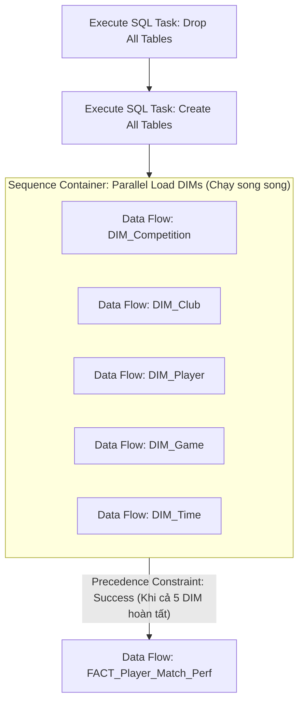
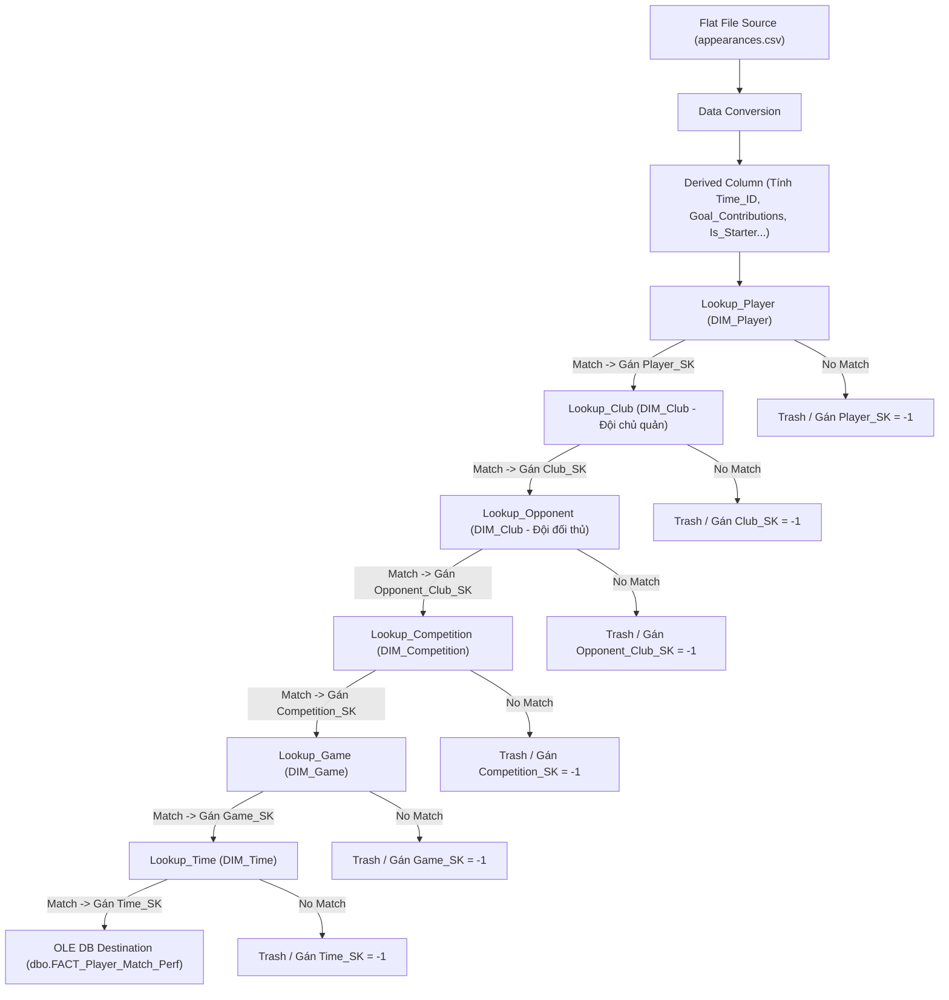

# THIẾT KẾ KHO DỮ LIỆU & QUY TRÌNH SSIS ETL
## DỰ ÁN: PHÂN TÍCH HIỆU SUẤT CẦU THỦ BÓNG ĐÁ CHÂU ÂU (2022 - 2024)

---

## 1. SƠ ĐỒ HÌNH SAO (STAR SCHEMA ERD)

```mermaid
erDiagram
    DIM_Player ||--o{ FACT_Player_Match_Perf : "1 - N (Player_SK)"
    DIM_Club ||--o{ FACT_Player_Match_Perf : "1 - N (Club_SK)"
    DIM_Club ||--o{ FACT_Player_Match_Perf : "1 - N (Opponent_Club_SK)"
    DIM_Competition ||--o{ FACT_Player_Match_Perf : "1 - N (Competition_SK)"
    DIM_Game ||--o{ FACT_Player_Match_Perf : "1 - N (Game_SK)"
    DIM_Time ||--o{ FACT_Player_Match_Perf : "1 - N (Time_SK)"

    DIM_Player {
        int Player_SK PK "Surrogate Key (Identity)"
        int Player_ID BK "Natural Key"
        nvarchar Player_Name "Họ tên cầu thủ"
        nvarchar Date_Of_Birth "Ngày sinh (YYYY-MM-DD)"
        int Age "Tuổi [15 - 50]"
        nvarchar Country_Of_Citizenship "Quốc tịch"
        nvarchar Main_Position "Vị trí chính"
        nvarchar Sub_Position "Vị trí chi tiết"
        nvarchar Foot "Chân thuận (Left, Right, Both)"
        int Height_In_Cm "Chiều cao [150 - 220]"
    }

    DIM_Club {
        int Club_SK PK "Surrogate Key (Identity)"
        int Club_ID BK "Natural Key"
        nvarchar Club_Name "Tên câu lạc bộ"
        nvarchar Stadium_Name "Tên sân vận động"
        int Stadium_Seats "Sức chứa [0 - 150000]"
        nvarchar Coach_Name "Huấn luyện viên"
        int Squad_Size "Quy mô đội hình [10 - 60]"
    }

    DIM_Competition {
        int Competition_SK PK "Surrogate Key (Identity)"
        nvarchar Competition_ID BK "Mã giải đấu (GB1, ES1, CL...)"
        nvarchar Competition_Name "Tên giải đấu"
        nvarchar Country_Name "Quốc gia"
        nvarchar Competition_Type "domestic_league / international_cup"
    }

    DIM_Game {
        int Game_SK PK "Surrogate Key (Identity)"
        int Game_ID BK "Natural Key"
        int Season "Mùa giải (2022, 2023, 2024)"
        nvarchar Round "Vòng đấu (Matchday 1, Final...)"
        int Home_Club_ID "Mã đội chủ nhà"
        int Away_Club_ID "Mã đội khách"
        int Home_Club_Goals "Bàn thắng đội nhà"
        int Away_Club_Goals "Bàn thắng đội khách"
        nvarchar Stadium "Sân vận động tổ chức"
    }

    DIM_Time {
        int Time_SK PK "Surrogate Key (Identity)"
        int Time_ID BK "YYYYMMDD"
        nvarchar Full_Date "YYYY-MM-DD"
        nvarchar Day_Of_Week "Thứ trong tuần"
        int Day "Ngày (1 - 31)"
        int Month "Tháng (1 - 12)"
        int Quarter "Quý (1 - 4)"
        int Year "Năm (2020 - 2030)"
        nvarchar Season "Mùa giải"
        int Is_Weekend "1: Cuối tuần, 0: Ngày thường"
    }

    FACT_Player_Match_Perf {
        int Appearance_ID PK "Fact Key (Identity)"
        int Player_SK FK "Khóa ngoại DIM_Player"
        int Club_SK FK "Khóa ngoại DIM_Club (Đội cầu thủ)"
        int Opponent_Club_SK FK "Khóa ngoại DIM_Club (Đội đối thủ)"
        int Competition_SK FK "Khóa ngoại DIM_Competition"
        int Game_SK FK "Khóa ngoại DIM_Game"
        int Time_SK FK "Khóa ngoại DIM_Time"
        int Game_ID "Natural Key trận đấu"
        int Minutes_Played "Số phút thi đấu"
        int Goals "Số bàn thắng"
        int Assists "Số kiến tạo"
        int Goal_Contributions "Goals + Assists"
        int Yellow_Cards "Thẻ vàng"
        int Red_Cards "Thẻ đỏ"
        float Market_Value_In_EUR "Giá trị thị trường (€)"
        int Is_Starter "1: Đá chính, 0: Dự bị"
        int Is_Home_Game "1: Sân nhà, 0: Sân khách"
    }
```

---

## 2. QUY TRÌNH CONTROL FLOW: CHẠY SONG SONG CÁC BẢNG DIM VỚI SEQUENCE CONTAINER

Để tối ưu hóa thời gian chạy ETL, 5 bảng DIM độc lập nhau được đặt trong **Sequence Container: Parallel Load DIMs** để thực thi **đồng thời (Parallel Execution)** bằng đa luồng CPU. Bảng FACT chỉ bắt đầu nạp khi toàn bộ 5 bảng DIM đã hoàn thành thành công.



* **Cấu hình Control Flow:**
  1. `Drop All Tables`: Xóa FACT trước, xóa các DIM sau.
  2. `Create All Tables`: Tạo cấu trúc 5 DIM và FACT kèm các khóa ngoại.
  3. `Sequence Container`: Bên trong đặt 5 Data Flow Task không nối dây ràng buộc lẫn nhau $\rightarrow$ SSIS Engine tự động phân phối chạy song song 5 luồng.
  4. Nối từ cạnh ngoài `Sequence Container` $\rightarrow$ `FACT_Player_Match_Perf` với điều kiện `Success`.

---

## 3. QUY TRÌNH DATA FLOW CHI TIẾT TỪNG BẢNG CHIỀU (DIM) KÈM DOMAIN VALIDATION

> [!IMPORTANT]
> **CÁC QUY TẮC CẤU HÌNH SSIS BẮT BUỘC KHÔNG ĐƯỢC VI PHẠM:**
> 1. **Quy tắc đặt tên Output Alias trong Data Conversion:** Tất cả các cột ép kiểu xuất ra từ khối **Data Conversion** BẮT BUỘC phải dùng tiền tố **`dc_`** (Ví dụ: `dc_competition_id`, `dc_club_id`, `dc_player_name`...). **Tuyệt đối KHÔNG sử dụng tên mặc định `Copy of...`**.
> 2. **Quy tắc sử dụng khối Derived Column:** KHÔNG ĐƯỢC tự tiện thêm khối `Derived Column` vào luồng Data Flow nếu trong thiết kế/tài liệu chuẩn không yêu cầu. Luồng chuẩn của bảng DIM cơ bản là: **Flat File Source $\rightarrow$ Data Conversion (`dc_`) $\rightarrow$ Conditional Split $\rightarrow$ Sort (Distinct) $\rightarrow$ OLE DB Destination**. Chỉ dùng `Derived Column` khi có công thức tính toán/bóc tách thuộc tính bắt buộc (như tính `Age` hoặc bóc tách `Time_ID`).
> 3. **Quy tắc Domain Validation trong Conditional Split:** Trong khối **Conditional Split**, BẮT BUỘC phải kiểm tra điều kiện toàn vẹn (NULL/Length/Domain) cho **TOÀN BỘ CÁC CỘT** thuộc bảng đó, không được bỏ sót bất kỳ cột nào.

### 3.1. Quy trình DIM_Competition
1. **Nguồn:** `competitions.csv`.
2. **Data Conversion (Bắt buộc dùng tiền tố `dc_`):** 
   * `competition_id` $\rightarrow$ `dc_competition_id` (`[DT_WSTR, 50]`)
   * `name` $\rightarrow$ `dc_competition_name` (`[DT_WSTR, 200]`)
   * `country_name` $\rightarrow$ `dc_country_name` (`[DT_WSTR, 200]`)
   * `type` $\rightarrow$ `dc_competition_type` (`[DT_WSTR, 100]`)
3. **Conditional Split (Domain Validation - Check TOÀN BỘ 4 CỘT):**
   * **Điều kiện Hợp lệ (Valid Output: `Valid_Competitions`):**
     ```csharp
     !ISNULL(dc_competition_id) && LEN(TRIM(dc_competition_id)) > 0 &&
     !ISNULL(dc_competition_name) && LEN(TRIM(dc_competition_name)) > 0 &&
     !ISNULL(dc_country_name) && LEN(TRIM(dc_country_name)) > 0 &&
     !ISNULL(dc_competition_type) && LEN(TRIM(dc_competition_type)) > 0
     ```
   * **Điều kiện Lỗi (Invalid Output: `Invalid_Competitions`):** Bỏ qua hoặc đẩy ra log lỗi.
4. **Sort (Khử trùng lặp):** Sort theo `dc_competition_id` (Ascending) + tick **`Remove rows with duplicate sort values`**.
5. **OLE DB Destination:** Nạp các cột `dc_` tương ứng vào `dbo.DIM_Competition`.

---

### 3.2. Quy trình DIM_Club
1. **Nguồn:** `clubs.csv`.
2. **Data Conversion:**
   * `club_id` $\rightarrow$ `[DT_I4]`
   * `name` $\rightarrow$ `[DT_WSTR, 200]`
   * `stadium_name` $\rightarrow$ `[DT_WSTR, 200]`
   * `stadium_seats` $\rightarrow$ `[DT_I4]`
   * `coach_name` $\rightarrow$ `[DT_WSTR, 150]`
   * `squad_size` $\rightarrow$ `[DT_I4]`
3. **Derived Column (Làm sạch & Gán mặc định):**
   * Chuẩn hóa sức chứa: `ISNULL(stadium_seats) || stadium_seats < 0 ? 0 : stadium_seats`
   * Chuẩn hóa HLV: `ISNULL(coach_name) || TRIM(coach_name) == "" ? "Unknown" : TRIM(coach_name)`
4. **Conditional Split (Domain Validation):**
   * **Điều kiện Hợp lệ (Valid Output):**
     ```csharp
     !ISNULL(club_id) && club_id > 0 &&
     !ISNULL(name) && LEN(TRIM(name)) > 0 &&
     (stadium_seats >= 0 && stadium_seats <= 150000) &&
     (squad_size >= 10 && squad_size <= 60)
     ```
   * **Điều kiện Lỗi (Invalid Output):** Đẩy vào bảng log lỗi.
5. **OLE DB Destination:** Nạp vào `dbo.DIM_Club`.

---

### 3.3. Quy trình DIM_Player
1. **Nguồn:** `players.csv`.
2. **Data Conversion:**
   * `player_id` $\rightarrow$ `[DT_I4]`
   * `name` $\rightarrow$ `[DT_WSTR, 200]`
   * `date_of_birth` $\rightarrow$ `[DT_WSTR, 50]`
   * `country_of_citizenship` $\rightarrow$ `[DT_WSTR, 150]`
   * `position` $\rightarrow$ `[DT_WSTR, 50]`
   * `sub_position` $\rightarrow$ `[DT_WSTR, 100]`
   * `foot` $\rightarrow$ `[DT_WSTR, 20]`
   * `height_in_cm` $\rightarrow$ `[DT_I4]`
3. **Derived Column (Tính tuổi & Chuẩn hóa):**
   * Tính `Age`: `DATEDIFF("year", (DT_DATE)date_of_birth, GETDATE())`
   * Chuẩn hóa `Foot`: `ISNULL(foot) || (foot != "Left" && foot != "Right" && foot != "Both") ? "Unknown" : foot`
   * Chuẩn hóa `Height`: `ISNULL(height_in_cm) ? 0 : height_in_cm`
4. **Conditional Split (Domain Validation):**
   * **Điều kiện Hợp lệ (Valid Output):**
     ```csharp
     !ISNULL(player_id) && player_id > 0 &&
     !ISNULL(name) && LEN(TRIM(name)) >= 2 &&
     (Age >= 15 && Age <= 50) &&
     (height_in_cm == 0 || (height_in_cm >= 150 && height_in_cm <= 220)) &&
     (position == "Goalkeeper" || position == "Defender" || position == "Midfield" || position == "Attack")
     ```
   * **Điều kiện Lỗi (Invalid Output):** Đẩy sang file/bảng kiểm toán lỗi.
5. **OLE DB Destination:** Nạp vào `dbo.DIM_Player`.

---

### 3.4. Quy trình DIM_Game
1. **Nguồn:** `games.csv`.
2. **Data Conversion:**
   * `game_id` $\rightarrow$ `[DT_I4]`
   * `season` $\rightarrow$ `[DT_I4]`
   * `round` $\rightarrow$ `[DT_WSTR, 100]`
   * `home_club_id` $\rightarrow$ `[DT_I4]`
   * `away_club_id` $\rightarrow$ `[DT_I4]`
   * `home_club_goals` $\rightarrow$ `[DT_I4]`
   * `away_club_goals` $\rightarrow$ `[DT_I4]`
   * `stadium` $\rightarrow$ `[DT_WSTR, 200]`
3. **Derived Column (Làm sạch):**
   * Xử lý NULL bàn thắng: `ISNULL(home_club_goals) ? 0 : home_club_goals`, `ISNULL(away_club_goals) ? 0 : away_club_goals`
   * Sân thi đấu: `ISNULL(stadium) ? "Unknown Stadium" : TRIM(stadium)`
4. **Conditional Split (Domain Validation):**
   * **Điều kiện Hợp lệ (Valid Output):**
     ```csharp
     !ISNULL(game_id) && game_id > 0 &&
     (season >= 2020 && season <= 2030) &&
     !ISNULL(home_club_id) && !ISNULL(away_club_id) && (home_club_id != away_club_id) &&
     (home_club_goals >= 0 && away_club_goals >= 0)
     ```
   * **Điều kiện Lỗi (Invalid Output):** Bỏ qua trận đấu không hợp lệ.
5. **OLE DB Destination:** Nạp vào `dbo.DIM_Game`.

---

### 3.5. Quy trình DIM_Time
1. **Nguồn:** `games.csv` hoặc bảng lịch phát sinh thời gian.
2. **Data Conversion:** `date` $\rightarrow$ `[DT_DATE]`.
3. **Derived Column (Trích xuất thuộc tính lịch):**
   * `Time_ID`: `(YEAR(date) * 10000) + (MONTH(date) * 100) + DAY(date)`
   * `Full_Date`: `(DT_WSTR, 50)date`
   * `Day`: `DAY(date)`
   * `Month`: `MONTH(date)`
   * `Quarter`: `DATEPART("quarter", date)`
   * `Year`: `YEAR(date)`
   * `Day_Of_Week`: Tên thứ trong tuần
   * `Is_Weekend`: `(DATEPART("dw", date) == 1 || DATEPART("dw", date) == 7) ? 1 : 0`
   * `Season`: `MONTH(date) >= 7 ? (DT_WSTR, 4)YEAR(date) + "/" + (DT_WSTR, 4)(YEAR(date) + 1) : (DT_WSTR, 4)(YEAR(date) - 1) + "/" + (DT_WSTR, 4)YEAR(date)`
4. **Conditional Split (Domain Validation):**
   * **Điều kiện Hợp lệ (Valid Output):**
     ```csharp
     Time_ID >= 20200101 && Time_ID <= 20301231 &&
     Day >= 1 && Day <= 31 &&
     Month >= 1 && Month <= 12 &&
     Quarter >= 1 && Quarter <= 4
     ```
5. **Sort (Loại bỏ trùng lặp):** Check ô `Remove rows with duplicate sort values` theo khóa `Time_ID`.
6. **OLE DB Destination:** Nạp vào `dbo.DIM_Time`.

---

## 4. QUY TRÌNH DATA FLOW CỦA BẢNG SỰ KIỆN (FACT) & GIẢI PHÁP TẠO KHÓA NGOẠI

> [!IMPORTANT]
> **Component chịu trách nhiệm tạo và ánh xạ khóa ngoại (Foreign Keys / Surrogate Keys) từ các bảng DIM sang FACT là:**
> **`LOOKUP TRANSFORMATION`** *(Lookup Component)*.

### 4.1. Quy trình tổng thể Data Flow FACT_Player_Match_Perf
1. **Flat File Source:** Đọc dữ liệu từ `appearances.csv`.
2. **Data Conversion:** Ép kiểu các trường nguồn (`appearance_id`, `player_id`, `player_club_id`, `competition_id`, `game_id`, `date`, `goals`, `assists`, `minutes_played`, `yellow_cards`, `red_cards`...).
3. **Derived Column 1 (Tiền xử lý Fact):**
   * Tạo khóa ngày `Time_ID`: `(YEAR((DT_DATE)date) * 10000) + (MONTH((DT_DATE)date) * 100) + DAY((DT_DATE)date)`
   * Tính `Goal_Contributions`: `goals + assists`
   * Xác định `Is_Starter`: `minutes_played > 45 ? 1 : 0` (hoặc cờ từ nguồn)
4. **Chuỗi 6 Lookup Transformations để lấy Khóa ngoại (Surrogate Keys):**
   * **Lookup 1 (`Lookup_Player`):**
     * Kết nối: `dbo.DIM_Player`
     * Điều kiện Join: `Input.player_id == DIM_Player.Player_ID`
     * Cột trích xuất: Lấy `Player_SK`.
   * **Lookup 2 (`Lookup_Club` - Đội chủ quản):**
     * Kết nối: `dbo.DIM_Club`
     * Điều kiện Join: `Input.player_club_id == DIM_Club.Club_ID`
     * Cột trích xuất: Lấy `Club_SK`.
   * **Lookup 3 (`Lookup_Opponent` - Đội đối thủ):**
     * Kết nối: `dbo.DIM_Club`
     * Điều kiện Join: `Input.opponent_id == DIM_Club.Club_ID`
     * Cột trích xuất: Lấy `Opponent_Club_SK`.
   * **Lookup 4 (`Lookup_Competition`):**
     * Kết nối: `dbo.DIM_Competition`
     * Điều kiện Join: `Input.competition_id == DIM_Competition.Competition_ID`
     * Cột trích xuất: Lấy `Competition_SK`.
   * **Lookup 5 (`Lookup_Game`):**
     * Kết nối: `dbo.DIM_Game`
     * Điều kiện Join: `Input.game_id == DIM_Game.Game_ID`
     * Cột trích xuất: Lấy `Game_SK`.
   * **Lookup 6 (`Lookup_Time`):**
     * Kết nối: `dbo.DIM_Time`
     * Điều kiện Join: `Input.Time_ID == DIM_Time.Time_ID`
     * Cột trích xuất: Lấy `Time_SK`.
5. **Cấu hình xử lý No-Match (Không tìm thấy khóa):**
   * Trong từng Lookup, tại mục *Specify how to handle rows with no matching entries*, chọn **`Redirect rows to no match output`**.
   * Dẫn luồng No-Match qua `Derived Column` để gán giá trị khóa mặc định = `-1` (Unknown Record) rồi `Union All` lại luồng chính (hoặc đẩy sang bảng kiểm toán lỗi).
6. **OLE DB Destination:** Nạp các khóa ngoại và độ đo vào `dbo.FACT_Player_Match_Perf`.

---

## 5. SƠ ĐỒ PIPELINE LOOKUP CỦA FACT



---

## 6. SCRIPT SQL NHÚNG TRỰC TIẾP TRONG 2 BLOCK EXECUTE SQL TASK (DIRECT INPUT)

Toàn bộ các câu lệnh SQL dưới đây được cấu hình dạng **Direct input** nằm trực tiếp bên trong 2 block **Execute SQL Task** trong Control Flow (không cần file script ngoài, không phụ thuộc đường dẫn):
* **Connection:** `DESKTOP-9B88R8P.DW_Football_Analytics` (hoặc kết nối OLE DB chung).
* **SQLSourceType:** `Direct input`.

### 6.1. Block "Drop All Tables" (Execute SQL Task)
Nhấp đúp vào Task `Drop All Tables` $\rightarrow$ tại ô **SQLStatement**, dán đoạn script sau:

```sql
USE DW_Football_Analytics;
GO

-- Xóa bảng FACT trước để tránh lỗi vi phạm Foreign Key
IF OBJECT_ID('dbo.FACT_Player_Match_Perf', 'U') IS NOT NULL DROP TABLE dbo.FACT_Player_Match_Perf;

-- Xóa 5 bảng DIM
IF OBJECT_ID('dbo.DIM_Player', 'U') IS NOT NULL DROP TABLE dbo.DIM_Player;
IF OBJECT_ID('dbo.DIM_Club', 'U') IS NOT NULL DROP TABLE dbo.DIM_Club;
IF OBJECT_ID('dbo.DIM_Competition', 'U') IS NOT NULL DROP TABLE dbo.DIM_Competition;
IF OBJECT_ID('dbo.DIM_Game', 'U') IS NOT NULL DROP TABLE dbo.DIM_Game;
IF OBJECT_ID('dbo.DIM_Time', 'U') IS NOT NULL DROP TABLE dbo.DIM_Time;
GO
```

### 6.2. Block "Create All Tables" (Execute SQL Task)
Nhấp đúp vào Task `Create All Tables` $\rightarrow$ tại ô **SQLStatement**, dán đoạn script sau:

```sql
USE DW_Football_Analytics;
GO

-- 1. TẠO 5 BẢNG CHIỀU (DIMENSIONS)
CREATE TABLE dbo.DIM_Competition (
    Competition_SK INT IDENTITY(1,1) CONSTRAINT PK_DIM_Competition PRIMARY KEY,
    Competition_ID NVARCHAR(50) NOT NULL,
    Competition_Name NVARCHAR(200) NULL,
    Country_Name NVARCHAR(200) NULL,
    Competition_Type NVARCHAR(100) NULL
);

CREATE TABLE dbo.DIM_Club (
    Club_SK INT IDENTITY(1,1) CONSTRAINT PK_DIM_Club PRIMARY KEY,
    Club_ID INT NOT NULL,
    Club_Name NVARCHAR(200) NULL,
    Stadium_Name NVARCHAR(200) NULL,
    Stadium_Seats INT NULL,
    Coach_Name NVARCHAR(150) NULL,
    Squad_Size INT NULL
);

CREATE TABLE dbo.DIM_Player (
    Player_SK INT IDENTITY(1,1) CONSTRAINT PK_DIM_Player PRIMARY KEY,
    Player_ID INT NOT NULL,
    Player_Name NVARCHAR(200) NULL,
    Date_Of_Birth NVARCHAR(50) NULL,
    Age INT NULL,
    Country_Of_Citizenship NVARCHAR(150) NULL,
    Main_Position NVARCHAR(50) NULL,
    Sub_Position NVARCHAR(100) NULL,
    Foot NVARCHAR(20) NULL,
    Height_In_Cm INT NULL
);

CREATE TABLE dbo.DIM_Game (
    Game_SK INT IDENTITY(1,1) CONSTRAINT PK_DIM_Game PRIMARY KEY,
    Game_ID INT NOT NULL,
    Season INT NULL,
    Round NVARCHAR(100) NULL,
    Home_Club_ID INT NULL,
    Away_Club_ID INT NULL,
    Home_Club_Goals INT NULL,
    Away_Club_Goals INT NULL,
    Stadium NVARCHAR(200) NULL
);

CREATE TABLE dbo.DIM_Time (
    Time_SK INT IDENTITY(1,1) CONSTRAINT PK_DIM_Time PRIMARY KEY,
    Time_ID INT NOT NULL, -- YYYYMMDD
    Full_Date NVARCHAR(50) NULL,
    Day_Of_Week NVARCHAR(50) NULL,
    Day INT NULL,
    Month INT NULL,
    Quarter INT NULL,
    Year INT NULL,
    Season NVARCHAR(50) NULL,
    Is_Weekend INT NULL
);
GO

-- 2. TẠO BẢNG SỰ KIỆN (FACT) VỚI KHÓA NGOẠI LIÊN KẾT 5 BẢNG DIM
CREATE TABLE dbo.FACT_Player_Match_Perf (
    Appearance_ID INT IDENTITY(1,1) CONSTRAINT PK_FACT_Player_Match_Perf PRIMARY KEY,
    Player_SK INT NOT NULL,
    Club_SK INT NOT NULL,
    Opponent_Club_SK INT NOT NULL,
    Competition_SK INT NOT NULL,
    Game_SK INT NOT NULL,
    Time_SK INT NOT NULL,
    Game_ID INT NOT NULL,
    Minutes_Played INT DEFAULT 0,
    Goals INT DEFAULT 0,
    Assists INT DEFAULT 0,
    Goal_Contributions INT DEFAULT 0,
    Yellow_Cards INT DEFAULT 0,
    Red_Cards INT DEFAULT 0,
    Market_Value_In_EUR FLOAT DEFAULT 0.0,
    Is_Starter INT DEFAULT 0,
    Is_Home_Game INT DEFAULT 0,

    -- Ràng buộc khóa ngoại
    CONSTRAINT FK_Fact_Player FOREIGN KEY (Player_SK) REFERENCES dbo.DIM_Player(Player_SK),
    CONSTRAINT FK_Fact_Club FOREIGN KEY (Club_SK) REFERENCES dbo.DIM_Club(Club_SK),
    CONSTRAINT FK_Fact_Opponent_Club FOREIGN KEY (Opponent_Club_SK) REFERENCES dbo.DIM_Club(Club_SK),
    CONSTRAINT FK_Fact_Competition FOREIGN KEY (Competition_SK) REFERENCES dbo.DIM_Competition(Competition_SK),
    CONSTRAINT FK_Fact_Game FOREIGN KEY (Game_SK) REFERENCES dbo.DIM_Game(Game_SK),
    CONSTRAINT FK_Fact_Time FOREIGN KEY (Time_SK) REFERENCES dbo.DIM_Time(Time_SK)
);
GO
```
