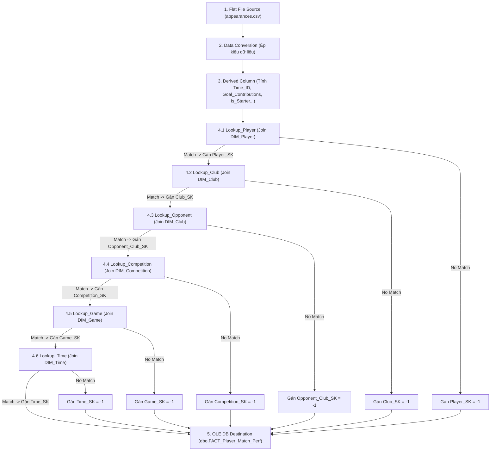

# BẢNG SỰ KIỆN: FACT_PLAYER_MATCH_PERF (HIỆU SUẤT TRẬN ĐẤU CỦA CẦU THỦ)

## 1. TỔNG QUAN & VAI TRÒ TRONG KHO DỮ LIỆU

Bảng `FACT_Player_Match_Perf` là bảng Sự kiện trung tâm (Central Fact Table) trong sơ đồ hình sao (Star Schema) của Kho dữ liệu bóng đá. Bảng này lưu trữ chi tiết mức độ đóng góp chuyên môn, chỉ số hiệu suất thi đấu, số phút có mặt trên sân, các sự kiện bàn thắng, kiến tạo, thẻ phạt và giá trị thị trường ước tính của từng cầu thủ trong mỗi lượt ra sân thi đấu.

* **Tên bảng:** `dbo.FACT_Player_Match_Perf`
* **Loại bảng:** Fact Table (Transactional Grain: Single Player Appearance per Match)
* **Mức độ hạt (Grain):** Mỗi bản ghi đại diện cho **1 lượt ra sân thi đấu của 1 cầu thủ trong 1 trận đấu cụ thể**.
* **Khóa chính (PK):** `Appearance_ID` (Surrogate Key - Identity)
* **Số lượng Khóa ngoại (FK):** 6 khóa ngoại liên kết tới 5 bảng Chiều (`DIM_Player`, `DIM_Club`, `DIM_Competition`, `DIM_Game`, `DIM_Time`).

---

## 2. CẤU TRÚC THUỘC TÍNH (TABLE SCHEMA & MEASURES)

| Khóa / Độ đo | Tên thuộc tính trong DW | Kiểu dữ liệu DW | Ràng buộc / Constraint | Mô tả chi tiết |
| :---: | :--- | :--- | :--- | :--- |
| 🔑 **PK** | `Appearance_ID` | `INT` | `IDENTITY(1,1)`, `PRIMARY KEY` | Mã định danh lượt ra sân tự tăng |
| 🔗 **FK 1** | `Player_SK` | `INT` | `FOREIGN KEY` $\rightarrow$ `DIM_Player` | Khóa ngoại tra cứu thông tin tiểu sử cầu thủ |
| 🔗 **FK 2** | `Club_SK` | `INT` | `FOREIGN KEY` $\rightarrow$ `DIM_Club` | Khóa ngoại tra cứu câu lạc bộ chủ quản của cầu thủ |
| 🔗 **FK 3** | `Opponent_Club_SK` | `INT` | `FOREIGN KEY` $\rightarrow$ `DIM_Club` | Khóa ngoại tra cứu câu lạc bộ đối thủ |
| 🔗 **FK 4** | `Competition_SK` | `INT` | `FOREIGN KEY` $\rightarrow$ `DIM_Competition` | Khóa ngoại tra cứu thông tin giải đấu |
| 🔗 **FK 5** | `Game_SK` | `INT` | `FOREIGN KEY` $\rightarrow$ `DIM_Game` | Khóa ngoại tra cứu chi tiết trận đấu |
| 🔗 **FK 6** | `Time_SK` | `INT` | `FOREIGN KEY` $\rightarrow$ `DIM_Time` | Khóa ngoại tra cứu thời gian diễn ra trận đấu |
| 📌 **BK** | `Game_ID` | `INT` | `NOT NULL` | Mã trận đấu tự nhiên |
| 📊 **Measure** | `Minutes_Played` | `INT` | `DEFAULT 0, CHECK >= 0` | Số phút trực tiếp thi đấu trên sân |
| 📊 **Measure** | `Goals` | `INT` | `DEFAULT 0, CHECK >= 0` | Số bàn thắng cầu thủ ghi được |
| 📊 **Measure** | `Assists` | `INT` | `DEFAULT 0, CHECK >= 0` | Số đường chuyền kiến tạo thành bàn |
| 📊 **Measure** | `Goal_Contributions` | `INT` | `DEFAULT 0` | Tổng đóng góp bàn thắng (`Goals + Assists`) |
| 📊 **Measure** | `Yellow_Cards` | `INT` | `DEFAULT 0, CHECK >= 0` | Số thẻ vàng cầu thủ phải nhận trong trận |
| 📊 **Measure** | `Red_Cards` | `INT` | `DEFAULT 0, CHECK >= 0` | Số thẻ đỏ cầu thủ phải nhận trong trận |
| 📊 **Measure** | `Market_Value_In_EUR`| `FLOAT` | `DEFAULT 0.0, CHECK >= 0` | Giá trị thị trường ước tính của cầu thủ (Euro) |
| 🚩 **Flag** | `Is_Starter` | `INT` | `CHECK (Is_Starter IN (0, 1))` | Cờ đá chính (`1`: Đá chính, `0`: Vào sân từ ghế dự bị) |
| 🚩 **Flag** | `Is_Home_Game` | `INT` | `CHECK (Is_Home_Game IN (0, 1))` | Cờ sân nhà (`1`: Thi đấu sân nhà, `0`: Thi đấu sân khách) |

---

## 3. PHÂN TÍCH ĐỐI CHIẾU DỮ LIỆU NGUỒN KAGGLE (KAGGLE CROSS-CHECKING)

* **Tệp CSV nguồn chính:** `appearances.csv` (13 cột thuộc tính gốc).
* **Tệp CSV nguồn bổ trợ:** `players.csv`, `games.csv`, `player_valuations.csv`, `club_games.csv`.
* **Đường dẫn dataset gốc:** [Kaggle - Transfermarkt Player Scores](https://www.kaggle.com/datasets/davidcariboo/player-scores)

### 3.1. Các cột được chuyển thành Khóa thay thế và Độ đo trong Fact

| Cột nguồn (Kaggle) | Tệp CSV nguồn | Cột đích (DW Fact) | Vai trò / Kiểu dữ liệu | Đánh giá & Biến đổi SSIS ETL |
| :--- | :--- | :--- | :--- | :--- |
| `player_id` | `appearances.csv` | `Player_SK` | Foreign Key (`INT`) | SSIS Lookup vào `DIM_Player` $\rightarrow$ Lấy `Player_SK` |
| `player_club_id` | `appearances.csv` | `Club_SK` | Foreign Key (`INT`) | SSIS Lookup vào `DIM_Club` $\rightarrow$ Lấy `Club_SK` |
| `opponent_id` | `club_games.csv` | `Opponent_Club_SK` | Foreign Key (`INT`) | SSIS Lookup vào `DIM_Club` $\rightarrow$ Lấy `Opponent_Club_SK` |
| `competition_id` | `appearances.csv` | `Competition_SK` | Foreign Key (`INT`) | SSIS Lookup vào `DIM_Competition` $\rightarrow$ Lấy `Competition_SK` |
| `game_id` | `appearances.csv` | `Game_SK` | Foreign Key (`INT`) | SSIS Lookup vào `DIM_Game` $\rightarrow$ Lấy `Game_SK` |
| `date` | `appearances.csv` | `Time_SK` | Foreign Key (`INT`) | Calculated `Time_ID` $\rightarrow$ SSIS Lookup `DIM_Time` $\rightarrow$ Lấy `Time_SK` |
| `minutes_played` | `appearances.csv` | `Minutes_Played` | Measure (`INT`) | **Giữ nguyên:** Số phút thi đấu trên sân |
| `goals` | `appearances.csv` | `Goals` | Measure (`INT`) | **Giữ nguyên:** Số bàn thắng ghi được |
| `assists` | `appearances.csv` | `Assists` | Measure (`INT`) | **Giữ nguyên:** Số đường kiến tạo thành bàn |
| `yellow_cards` | `appearances.csv` | `Yellow_Cards` | Measure (`INT`) | **Giữ nguyên:** Số thẻ vàng nhận phải |
| `red_cards` | `appearances.csv` | `Red_Cards` | Measure (`INT`) | **Giữ nguyên:** Số thẻ đỏ nhận phải |
| `market_value_in_eur` | `player_valuations.csv`| `Market_Value_In_EUR`| Measure (`FLOAT`) | **Bổ trợ:** Tra cứu mốc định giá gần nhất của cầu thủ tại ngày thi đấu |
| Calculated | - | `Goal_Contributions` | Measure (`INT`) | **Thêm mới:** `Goals + Assists` (Tổng số lần in dấu giày vào bàn thắng) |
| Calculated | - | `Is_Starter` | Flag (`INT`) | **Thêm mới:** `minutes_played > 45 ? 1 : 0` (Cờ đá chính) |
| `hosting` | `club_games.csv` | `Is_Home_Game` | Flag (`INT`) | **Thêm mới:** `hosting == "Home" ? 1 : 0` (Cờ sân nhà) |

### 3.2. Các cột Khóa nguồn (Kaggle) BỊ BỎ QUA trong Fact và lý do (Omitted Keys)

| Cột Khóa nguồn (Kaggle) | Tệp Nguồn | Lý do bỏ qua không đưa vào Fact |
| :--- | :--- | :--- |
| `player_current_club_id` | `appearances.csv` | **Sai lệch lịch sử:** Mã CLB hiện tại của cầu thủ. Đã bị loại bỏ vì Fact cần lưu vết `player_club_id` (CLB mà cầu thủ khoác áo thi đấu **tại thời điểm trận đấu diễn ra**). Nếu dùng `player_current_club_id`, thống kê lịch sử của các mùa trước sẽ bị sai khi cầu thủ chuyển nhượng CLB mới. |

### 3.3. Các cột DƯ THỪA / KHÔNG CẦN THIẾT trong Kaggle (Surplus & Redundant Columns)

| Cột Dư thừa (Kaggle) | Tệp Nguồn | Lý do xác định dư thừa & Loại bỏ |
| :--- | :--- | :--- |
| `player_name` | `appearances.csv` | **Dư thừa văn bản trong Fact:** Tên dạng chuỗi ký tự của cầu thủ. Đã bị loại bỏ vì trong mô hình Star Schema chuẩn, bảng Fact **tuyệt đối không lưu các trường mô tả văn bản chuỗi dài**. Tên cầu thủ được truy xuất linh hoạt bằng phép JOIN qua `Player_SK` vào `DIM_Player`. Việc lưu `player_name` trong Fact sẽ gây phình to dung lượng Fact table (vốn lưu hàng triệu bản ghi). |
| `date`, `competition_id`, `player_id`, `player_club_id`, `game_id` (văn bản/nguyên gốc) | `appearances.csv` | **Thay thế bằng Khóa thay thế (Surrogate Keys):** Các mã định danh gốc của hệ thống nguồn đã được thay thế bằng các khóa số nguyên tự tăng `Player_SK`, `Club_SK`, `Competition_SK`, `Game_SK`, `Time_SK` giúp tối ưu hóa dung lượng lưu trữ index và tăng tốc độ các phép JOIN OLAP. |

---

## 4. QUY TRÌNH LUỒNG DỮ LIỆU SSIS ETL (LOOKUP PIPELINE)

Quy trình nạp bảng Sự kiện `FACT_Player_Match_Perf` được thực hiện qua luồng SSIS Data Flow chuẩn hóa gồm **6 bước Lookup nối tiếp** để tra cứu Khóa thay thế (Surrogate Keys):

---

## 5. KIỂM THỨC VẸN TOÀN & CHẤT LƯỢNG DỮ LIỆU (DATA INTEGRITY)

* **Ràng buộc khóa ngoại (Foreign Key Constraints):** Toàn bộ 6 trường khóa ngoại trong Fact đều được thiết lập ràng buộc `FOREIGN KEY REFERENCES` với các bảng Dim tương ứng.
* **Xử lý triệt để No-Match Output:** 100% dòng dữ liệu không bị thất thoát khi nạp ETL nhờ chiến lược gán Khóa mặc định `-1` (Unknown Record) cho các bản ghi khuyết tham chiếu.
* **Kiểm tra hợp lệ chỉ số:**
  * `Minutes_Played`: Phải nằm trong khoảng `[0, 130]` phút.
  * `Goals` & `Assists`: Phải $\ge 0$.
  * `Goal_Contributions = Goals + Assists` được tính toán nhất quán.
