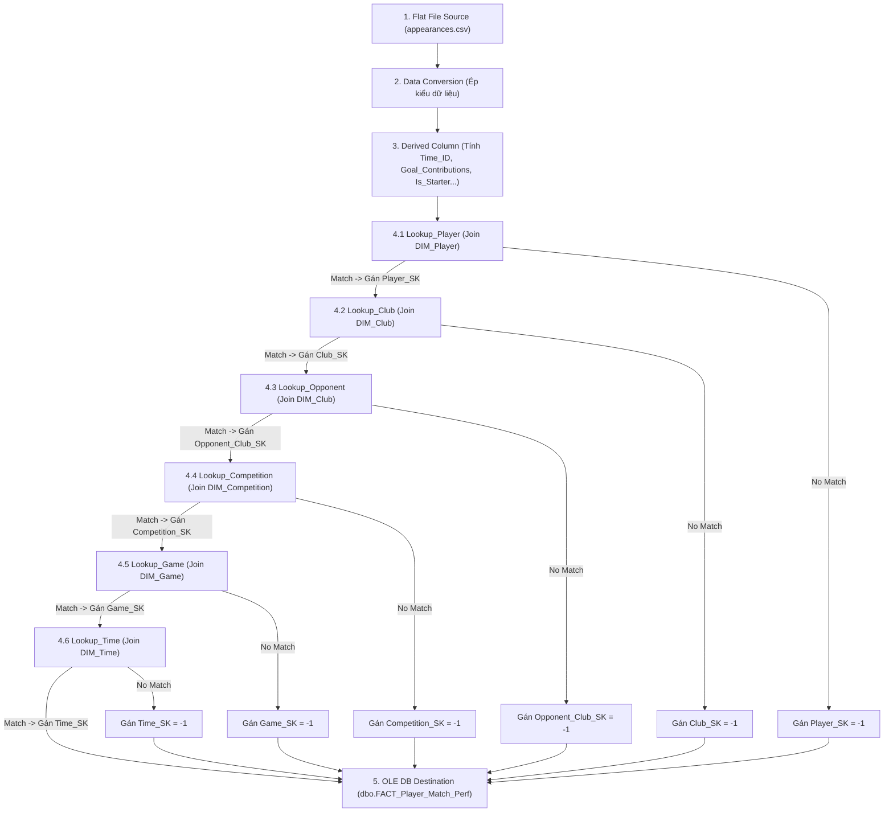

# BẢNG SỰ KIỆN: FACT_PLAYER_MATCH_PERF (HIỆU SUẤT TRẬN ĐẤU CỦA CẦU THỦ)

## 1. TỔNG QUAN & VAI TRÒ TRONG KHO DỮ LIỆU

Bảng `FACT_Player_Match_Perf` là bảng Sự kiện trung tâm (Central Fact Table) trong sơ đồ hình sao (Star Schema) của Kho dữ liệu bóng đá. Bảng này lưu trữ chi tiết mức độ đóng góp chuyên môn, chỉ số hiệu suất thi đấu, số phút có mặt trên sân, các sự kiện bàn thắng, kiến tạo, thẻ phạt và giá trị thị trường ước tính của từng cầu thủ trong mỗi lượt ra sân thi đấu.

* **Tên bảng:** `dbo.FACT_Player_Match_Perf`
* **Loại bảng:** Fact Table (Transactional Grain: Single Player Appearance per Match)
* **Mức độ hạt (Grain):** Mỗi bản ghi đại diện cho **1 lượt ra sân thi đấu của 1 cầu thủ trong 1 trận đấu cụ thể**.
* **Khóa chính (PK):** `Appearance_ID` (Surrogate Key - Identity)
* **Số lượng Khóa ngoại (FK):** 6 khóa ngoại liên kết tới 5 bảng Chiều (`DIM_Player`, `DIM_Club`, `DIM_Competition`, `DIM_Game`, `DIM_Time`).

---

## 2. CẤU TRÚC THUỘC TÍNH (TABLE SCHEMA & MEASURES)

| Khóa / Độ đo | Tên thuộc tính trong DW | Kiểu dữ liệu DW | Ràng buộc / Constraint | Mô tả chi tiết |
| :---: | :--- | :--- | :--- | :--- |
| 🔑 **PK** | `Appearance_ID` | `INT` | `IDENTITY(1,1)`, `PRIMARY KEY` | Mã định danh lượt ra sân tự tăng |
| 🔗 **FK 1** | `Player_SK` | `INT` | `FOREIGN KEY` $\rightarrow$ `DIM_Player` | Khóa ngoại tra cứu thông tin tiểu sử cầu thủ |
| 🔗 **FK 2** | `Club_SK` | `INT` | `FOREIGN KEY` $\rightarrow$ `DIM_Club` | Khóa ngoại tra cứu câu lạc bộ chủ quản của cầu thủ |
| 🔗 **FK 3** | `Opponent_Club_SK` | `INT` | `FOREIGN KEY` $\rightarrow$ `DIM_Club` | Khóa ngoại tra cứu câu lạc bộ đối thủ |
| 🔗 **FK 4** | `Competition_SK` | `INT` | `FOREIGN KEY` $\rightarrow$ `DIM_Competition` | Khóa ngoại tra cứu thông tin giải đấu |
| 🔗 **FK 5** | `Game_SK` | `INT` | `FOREIGN KEY` $\rightarrow$ `DIM_Game` | Khóa ngoại tra cứu chi tiết trận đấu |
| 🔗 **FK 6** | `Time_SK` | `INT` | `FOREIGN KEY` $\rightarrow$ `DIM_Time` | Khóa ngoại tra cứu thời gian diễn ra trận đấu |
| 📌 **BK** | `Game_ID` | `INT` | `NOT NULL` | Mã trận đấu tự nhiên |
| 📊 **Measure** | `Minutes_Played` | `INT` | `DEFAULT 0, CHECK >= 0` | Số phút trực tiếp thi đấu trên sân |
| 📊 **Measure** | `Goals` | `INT` | `DEFAULT 0, CHECK >= 0` | Số bàn thắng cầu thủ ghi được |
| 📊 **Measure** | `Assists` | `INT` | `DEFAULT 0, CHECK >= 0` | Số đường chuyền kiến tạo thành bàn |
| 📊 **Measure** | `Goal_Contributions` | `INT` | `DEFAULT 0` | Tổng đóng góp bàn thắng (`Goals + Assists`) |
| 📊 **Measure** | `Yellow_Cards` | `INT` | `DEFAULT 0, CHECK >= 0` | Số thẻ vàng cầu thủ phải nhận trong trận |
| 📊 **Measure** | `Red_Cards` | `INT` | `DEFAULT 0, CHECK >= 0` | Số thẻ đỏ cầu thủ phải nhận trong trận |
| 📊 **Measure** | `Market_Value_In_EUR`| `FLOAT` | `DEFAULT 0.0, CHECK >= 0` | Giá trị thị trường ước tính của cầu thủ (Euro) |
| 🚩 **Flag** | `Is_Starter` | `INT` | `CHECK (Is_Starter IN (0, 1))` | Cờ đá chính (`1`: Đá chính, `0`: Vào sân từ ghế dự bị) |
| 🚩 **Flag** | `Is_Home_Game` | `INT` | `CHECK (Is_Home_Game IN (0, 1))` | Cờ sân nhà (`1`: Thi đấu sân nhà, `0`: Thi đấu sân khách) |

---

## 3. ĐỐI CHIẾU & MAPPING VỚI BỘ DỮ LIỆU KAGGLE (TRANSFERMARKT)

* **Tệp CSV nguồn chính:** `appearances.csv` (13 cột thuộc tính gốc).
* **Tệp CSV nguồn bổ trợ:** `players.csv`, `games.csv`, `player_valuations.csv`, `club_games.csv`.
* **Đường dẫn dataset gốc:** [Kaggle - Transfermarkt Player Scores](https://www.kaggle.com/datasets/davidcariboo/player-scores)

### Bảng Ma Trận Ánh Xạ Chi Tiết (Kaggle Sources $\rightarrow$ DW Fact)

| Tệp CSV Nguồn | Cột thuộc tính nguồn (Kaggle) | Kiểu dữ liệu Kaggle | Cột thuộc tính đích (DW Fact) | Kiểu dữ liệu DW | Quy tắc biến đổi SSIS ETL / Lookup / Derived |
| :--- | :--- | :--- | :--- | :--- | :--- |
| `appearances.csv` | `player_id` | `Int64` | `Player_SK` | `INT` | Lookup vào `DIM_Player` theo `player_id` $\rightarrow$ Trích xuất `Player_SK` |
| `appearances.csv` | `player_club_id` | `Int64` | `Club_SK` | `INT` | Lookup vào `DIM_Club` theo `player_club_id` $\rightarrow$ Trích xuất `Club_SK` |
| `games.csv` / `club_games.csv` | `opponent_id` | `Int64` | `Opponent_Club_SK` | `INT` | Lookup vào `DIM_Club` theo `opponent_id` $\rightarrow$ Trích xuất `Opponent_Club_SK` |
| `appearances.csv` | `competition_id` | `string` | `Competition_SK` | `INT` | Lookup vào `DIM_Competition` theo `competition_id` $\rightarrow$ Trích xuất `Competition_SK` |
| `appearances.csv` | `game_id` | `Int64` | `Game_SK` | `INT` | Lookup vào `DIM_Game` theo `game_id` $\rightarrow$ Trích xuất `Game_SK` |
| `appearances.csv` | `date` | `string` | `Time_SK` | `INT` | Calculated `Time_ID` $\rightarrow$ Lookup vào `DIM_Time` theo `Time_ID` $\rightarrow$ Trích xuất `Time_SK` |
| `appearances.csv` | `game_id` | `Int64` | `Game_ID` | `INT` | Ép kiểu `(DT_I4)` giữ nguyên mã trận |
| `appearances.csv` | `minutes_played` | `Int64` | `Minutes_Played` | `INT` | Ép kiểu `(DT_I4)`, thay NULL bằng `0` |
| `appearances.csv` | `goals` | `Int64` | `Goals` | `INT` | Ép kiểu `(DT_I4)`, thay NULL bằng `0` |
| `appearances.csv` | `assists` | `Int64` | `Assists` | `INT` | Ép kiểu `(DT_I4)`, thay NULL bằng `0` |
| Calculated | `goals` + `assists` | `Int64` | `Goal_Contributions` | `INT` | Derived Column SSIS: `goals + assists` |
| `appearances.csv` | `yellow_cards` | `Int64` | `Yellow_Cards` | `INT` | Ép kiểu `(DT_I4)`, thay NULL bằng `0` |
| `appearances.csv` | `red_cards` | `Int64` | `Red_Cards` | `INT` | Ép kiểu `(DT_I4)`, thay NULL bằng `0` |
| `player_valuations.csv` | `market_value_in_eur`| `float64` | `Market_Value_In_EUR`| `FLOAT` | Lookup định giá cầu thủ gần nhất theo ngày $\rightarrow$ Gán giá trị |
| `appearances.csv` | `minutes_played` | `Int64` | `Is_Starter` | `INT` | Derived Column: `minutes_played > 45 ? 1 : 0` |
| `club_games.csv` | `is_win` / `hosting` | `string` | `Is_Home_Game` | `INT` | Derived Column: `hosting == "Home" ? 1 : 0` |

---

## 4. QUY TRÌNH LUỒNG DỮ LIỆU SSIS ETL (LOOKUP PIPELINE)

Quy trình nạp bảng Sự kiện `FACT_Player_Match_Perf` được thực hiện qua luồng SSIS Data Flow chuẩn hóa gồm **6 bước Lookup nối tiếp** để tra cứu Khóa thay thế (Surrogate Keys):

### Chi Tiết Cấu Hình 6 Transform Lookup:
1. **`Lookup_Player`:** Join `Input.player_id == DIM_Player.Player_ID`. Lấy `Player_SK`. Nếu No-Match $\rightarrow$ Redirect / Gán `Player_SK = -1`.
2. **`Lookup_Club`:** Join `Input.player_club_id == DIM_Club.Club_ID`. Lấy `Club_SK`. Nếu No-Match $\rightarrow$ Gán `Club_SK = -1`.
3. **`Lookup_Opponent`:** Join `Input.opponent_id == DIM_Club.Club_ID`. Lấy `Opponent_Club_SK`. Nếu No-Match $\rightarrow$ Gán `Opponent_Club_SK = -1`.
4. **`Lookup_Competition`:** Join `Input.competition_id == DIM_Competition.Competition_ID`. Lấy `Competition_SK`. Nếu No-Match $\rightarrow$ Gán `Competition_SK = -1`.
5. **`Lookup_Game`:** Join `Input.game_id == DIM_Game.Game_ID`. Lấy `Game_SK`. Nếu No-Match $\rightarrow$ Gán `Game_SK = -1`.
6. **`Lookup_Time`:** Join `Input.Time_ID == DIM_Time.Time_ID`. Lấy `Time_SK`. Nếu No-Match $\rightarrow$ Gán `Time_SK = -1`.

---

## 5. KIỂM THỨC VẸN TOÀN & CHẤT LƯỢNG DỮ LIỆU (DATA INTEGRITY)

* **Ràng buộc khóa ngoại (Foreign Key Constraints):** Toàn bộ 6 trường khóa ngoại trong Fact đều được thiết lập ràng buộc `FOREIGN KEY REFERENCES` với các bảng Dim tương ứng.
* **Xử lý triệt để No-Match Output:** 100% dòng dữ liệu không bị thất thoát khi nạp ETL nhờ chiến lược gán Khóa mặc định `-1` (Unknown Record) cho các bản ghi khuyết tham chiếu.
* **Kiểm tra hợp lệ chỉ số:**
  * `Minutes_Played`: Phải nằm trong khoảng `[0, 130]` phút (bao gồm cả bù giờ & hiệp phụ).
  * `Goals` & `Assists`: Phải $\ge 0$.
  * `Goal_Contributions = Goals + Assists` được tính toán nhất quán.
